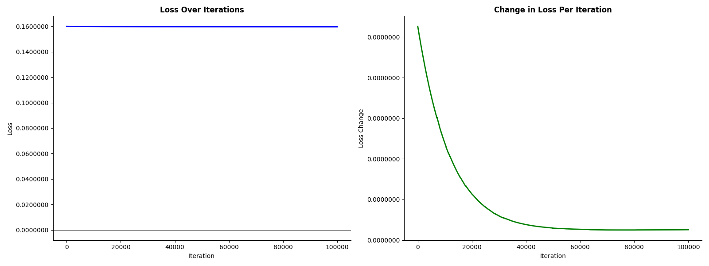
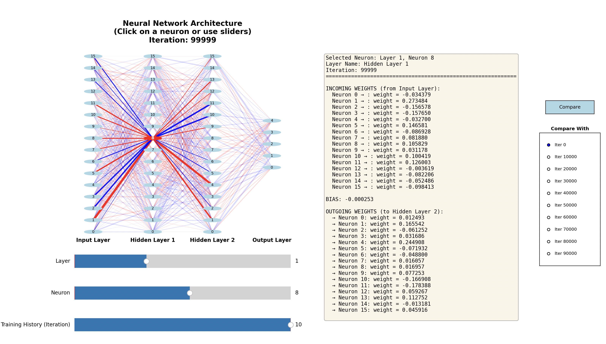
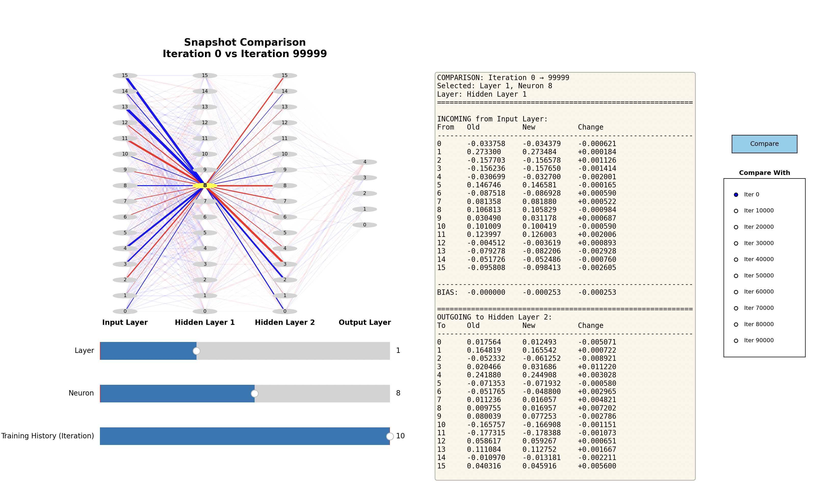

An example of a structure of a neural network using Backpropagation with interactive visualization.

## Features

- **Neural Network Training**: Train a neural network with backpropagation
- **Loss Visualization**: Track training progress with loss charts
- **Interactive Network Visualizer**: Explore network architecture, weights, and biases
- **Time Travel**: Step through training history iteration by iteration
- **Comparison Mode**: Compare network states between different training iterations

## Usage

You can start the program by calling the `main.py` script:

    python3 PythonApplication1/main.py

After execution, you'll see a loss chart followed by an interactive neural network visualizer.

### Loss Chart

The combined loss chart shows how the network's loss decreases during training:

### Interactive Neural Network Visualizer

The visualizer provides multiple ways to explore your trained network:

#### Basic Interaction

- **Click on any neuron** in the network diagram to inspect its connections
- **Use the Layer slider** to navigate between layers
- **Use the Neuron slider** to select a specific neuron within a layer
- **View weights and biases** in the information panel on the right

The visualization shows:
- **Red connections**: Positive weights
- **Blue connections**: Negative weights
- **Line thickness**: Magnitude of the weight (thicker = larger absolute value)
- **Highlighted neuron**: Currently selected neuron in red

#### Time Travel Feature

Navigate through training history using the "Training History (Iteration)" slider:

- Move the slider to view the network state at any training iteration
- See how weights and biases evolved during training
- The network diagram updates to show connection strengths at that iteration

#### Comparison Mode

Compare network states between two different iterations:

1. **Select the target iteration** using the "Training History" slider
2. **Click the "Compare" button** in the top-right corner
3. **Choose a baseline iteration** from the dropdown menu on the right
4. The visualization will show:
   - **Red connections**: Weights that increased
   - **Blue connections**: Weights that decreased
   - **Line thickness**: Magnitude of change
   - **Detailed change table**: Shows old value, new value, and change (with scientific notation for better readability)

Changes are displayed in scientific notation format (e.g., `+1.2345*10^-5`) for very small values, making it easier to read typical neural network weight updates.

### Advanced Usage

You can customize the training process and network architecture using command-line parameters:

* `-i, --iterations` - Number of iterations (positive value > 0, default 100000)
* `-m, --multiplier` - Learning rate/magnitude (floating point value, default 0.01)
* `-l, --layers` - Network architecture: list of layer sizes from input to output (default: 16 16 16 5)

#### Examples:

Train with custom iterations and learning rate:

    python3 PythonApplication1/main.py -i 100000 -m 0.001

Create a custom network architecture with 10 inputs, two hidden layers (8 and 6 neurons), and 3 outputs:

    python3 PythonApplication1/main.py -l 10 8 6 3

Combine all parameters for a fully customized training:

    python3 PythonApplication1/main.py -i 50000 -m 0.005 -l 20 15 10 5

**Note**: The first number in the layers list is the input layer size, the last is the output layer size, and all numbers in between define hidden layers. The network must have at least 2 layers (input and output), and all layers must have at least 1 neuron.

## Prerequisites

* Python version: 3.9.6 
* NumPy version: 2.0.2 
* Matplotlib version: 3.9.4

