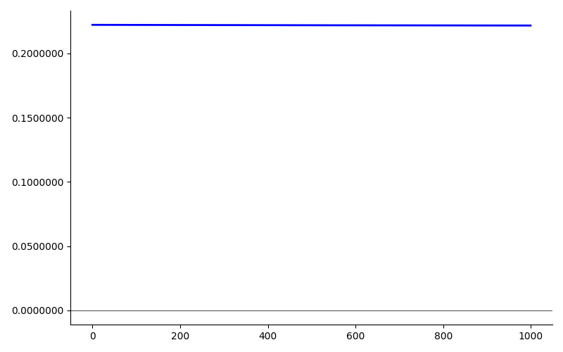
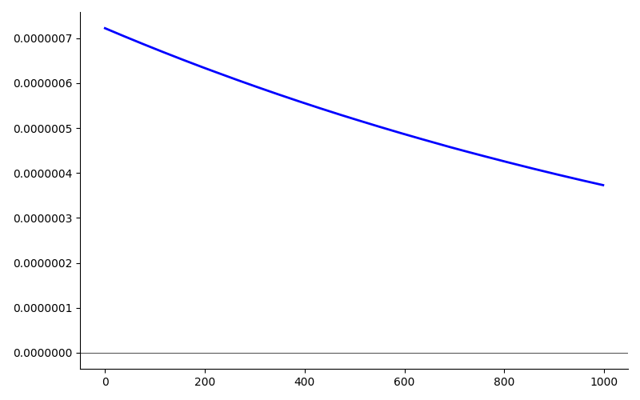

An example of a structure of a neural network using Backpropagation.

## Usage

You can start the programm by calling the `main.py` script:

    python3 PythonApplication1/main.py

After the execution you find this two graphs as result.

The graphs could look like this:

You can adjust both the number of iterations and the magnitude by which the weights and biases are updated in each iteration in [main.py](PythonApplication1/main.py). At the end of the program, it will display two graphs: the first shows the overall change in loss per iteration, while the second illustrates how the loss varies with each iteration.

## Prerequsites

* Python version: 3.9.6 
* NumPy version: 2.0.2 
* Matplotlib version: 3.9.4

